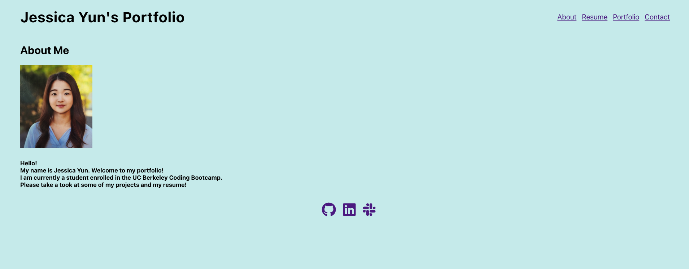

# Work-Portfolio

## Description

This project is my work portfolio. It showcases all the projects that I have created, a work resume that is downloadable, information about me, and a contacts page where users could contact me. There are icons on the footer of my page that also links my github, linkedin, and stackoverflow. This portfolio was created using REACT. There are notes within the different components.

Here is a screenshot of my application: 

Here is the link to the github for this project: https://github.com/jssoyoung/Work-Portfolio

Here is the link to the deployed application: https://jssoyoung.github.io/Work-Portfolio/

## Installation

No installation required

## Usage

This is an one-page portfolio website. The user will automatically be taken to the About Me page. The user could use the navigation bar at the top to also look at my resume, projects, or contact me. If the user clicks on "resume" on the navigation bar, a downloadable resume will pop up. If the user clicks on "projects" on the navigation bar, my top six projects will show up. Each project has a name, screenshot and the code used description. If the project's name is clicked, the user will be taken to my deployed application of that project. If they click on the github icon next to the project, they will be taken to the github repo of that project. If the user clicks on "Contact" in the navigation bar, they could input their email, name, and a message to send to me. On the footer of each page are three icons. The github icon, when clicked, will send the user to my github. The linkedin icon will take them to my linked in and the stackoverflow icon will take them to my stackoverflow.

## Credits

N/A

## License

Please refer to the LICENSE in the repo.